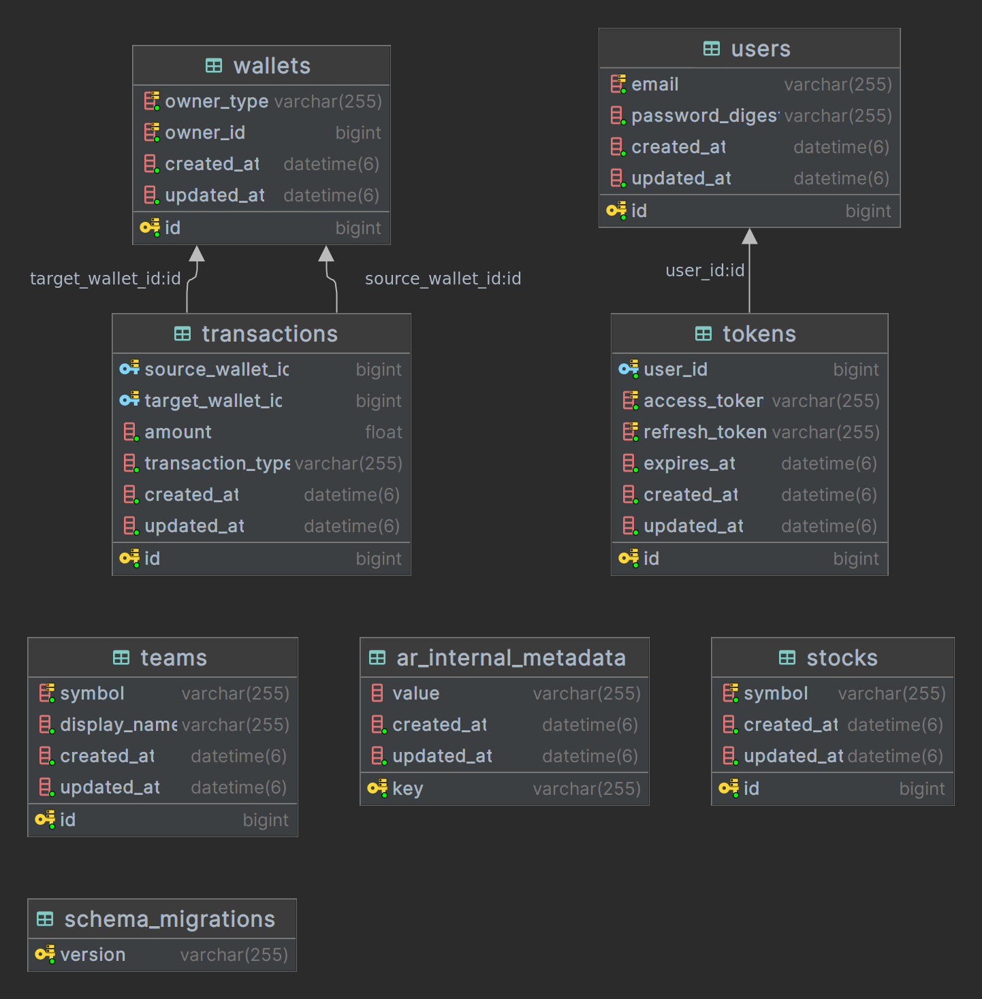
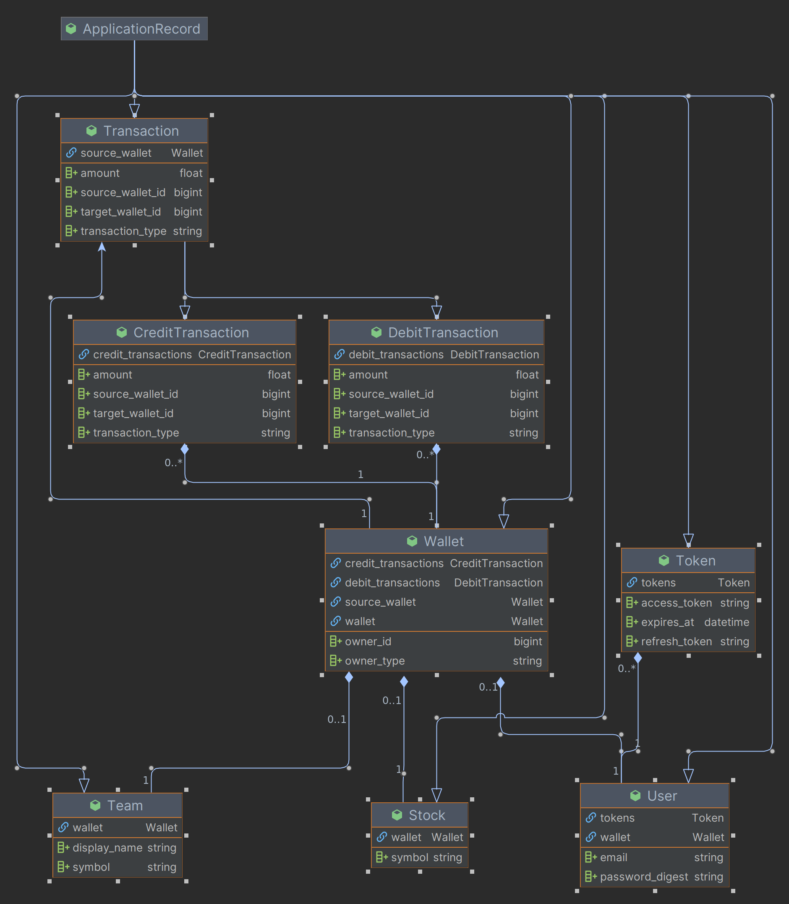
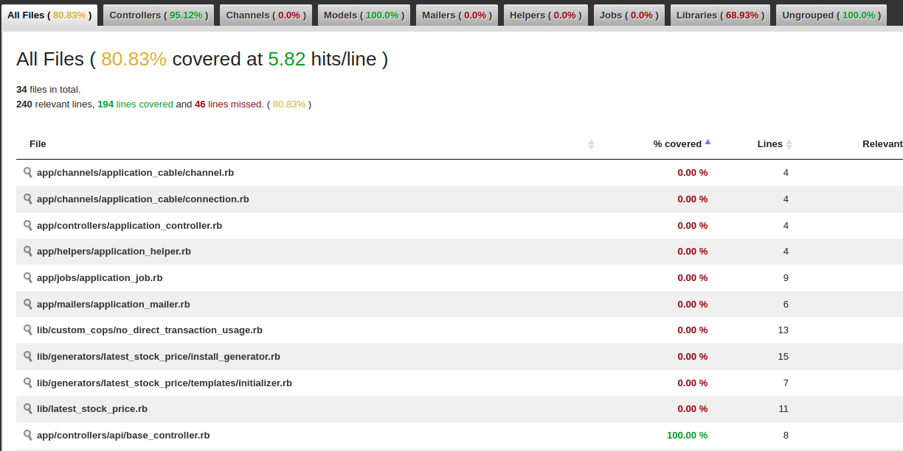
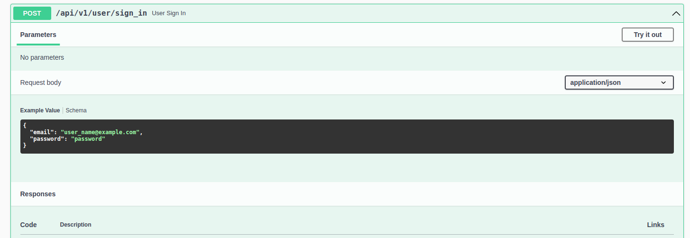

# GUIDE
[](https://github.com/lpwanw/rails_Internal_wallet_transactional/actions/workflows/ci.yml)

## 0. table of content

- [1. Development tools](#1-development-tools)
- [2. Getting started](#2-getting-started)
- [3. Tasks](#3-tasks)
    - [I. Model diagram & database design](#i-model-diagram--database-design)
    - [II. Full Validate & Rspec](#ii-full-validate--rspec)
    - [III. Apply STI](#iii-apply-sti)
    - [IV. Sign API](#iv-sign-api)
- [4. Requirement](#4-requirement)
  - [I. Polymorphic](#i-polymorphic)
  - [II. Record in database](#ii-record-in-database)
  - [III. Validate for each transaction](#iii-validate-for-each-transaction)
  - [IV. Apply ACID](#iv-apply-acid)
  - [V. Check Wallet balance](#v-check-wallet-balance)
  - [VI. Create Transaction](#vi-create-transaction)
  - [VII. Debit with amount larger than balance](#vii-debit-with-amount-larger-than-balance)

## 1. Development tools

- RVM (Ruby Version Manager)

- ruby 3.2.2

- Rails 7.0.6

- Bundler 2.4.15

- MySQL 8.0.33

## 2. Getting started

- Create your `.env` by copy `.env.example` and replace your ENVs

### a. prepare db
```shell
rails db:create
rails db:migrate
```
### b. API-docs
```shell
RAILS_ENV=test rails rswag
```
/api-docs
### c. Start Server
```shell
rails s -p 3000
```

## 3. Tasks
### I.Model diagram & database design



### II. Full Validate & Rspec


### III. Apply STI
- use 2 class `DebitTransaction` & `CreditTransaction` instead of `Transaction`
- Custom rubocop to check usage of `Transaction`
```sh
rubocop --only CustomCops/NoDirectTransactionUsage
```
### IV. Sign API



### V. LatestStockPrice as a Gem

#### a. Generators
Run below question to create config/initializers/latest_stock_price.rb
```sh
rails generate latest_stock_price:install
```

#### b. API keys
 - got to https://rapidapi.com/suneetk92/api/latest-stock-price.
 - get API key and saved as ENV["RAPID_API_KEY"] (or custom at `config/initializers/latest_stock_price.rb`)

#### c. Usage

##### API get Price

```sh
LatestStockPrice::Price.get_price(indices: "NIFTY 50", identifier: "HEROMOTOCOEQN")
```

##### API get PriceAll

```sh
LatestStockPrice::PriceAll.get_price_all(identifier: "HEROMOTOCOEQN")
```

## 4. Requirement

### I. polymorphic
    User, Team, Stock have their own wallet.

### II. record in database
    use Model Transaction to track all request
### III. Validate for each transaction
### IV. apply ACID
- A: check if balance of wallet is available to create debit transaction
- C: Validate in each transaction, each owner record
- I: use with_lock to ensure. multiple transaction process in the same time will not brake the wallet balance
- D: when the transaction is committed, it remain so
### V. Check Wallet balance
```ruby
# balance calculated by summing Transaction records
user.balance

# implementation
def balance
  credits = credit_transactions.sum(:amount)
  debits = debit_transactions.sum(:amount)
  credits - debits
end
```

### VI. Create Transaction
```ruby
user = User.find(user_id)    
# create credit transaction
user.wallet.credit_transactions.create(amount: amount)
# create debit transaction
user.wallet.debit_transactions.create(amount: amount)
```
### VII. Debit with amount larger than balance
```ruby
user = User.find 2
#User Load (0.8ms)  SELECT `users`.* FROM `users` WHERE `users`.`id` = 2 LIMIT 1
#=> #<User:0x00007fad847c7a98 id: 2, email: "lp.wanw+1@gmail.com", password_digest: "[FILTERED]", created_at: Fri, 15 Sep 2023 10:40:21.743916000 UTC +00:00, updated_at: Fri, 15 Sep 2023 10:40:21.743916000 UTC +00:00> 

user.wallet.debit_transactions.create(amount: user.balance + 1)
# Wallet Load (0.2ms)  SELECT `wallets`.* FROM `wallets` WHERE `wallets`.`owner_id` = 2 AND `wallets`.`owner_type` = 'User' LIMIT 1
# CreditTransaction Sum (0.3ms)  SELECT SUM(`transactions`.`amount`) FROM `transactions` WHERE `transactions`.`target_wallet_id` = 2
#  DebitTransaction Sum (0.2ms)  SELECT SUM(`transactions`.`amount`) FROM `transactions` WHERE `transactions`.`source_wallet_id` = 2
#  TRANSACTION (0.1ms)  BEGIN
#  Wallet Load (0.2ms)  SELECT `wallets`.* FROM `wallets` WHERE `wallets`.`id` = 2 LIMIT 1 FOR UPDATE
#  CreditTransaction Sum (0.2ms)  SELECT SUM(`transactions`.`amount`) FROM `transactions` WHERE `transactions`.`target_wallet_id` = 2
#  DebitTransaction Sum (0.2ms)  SELECT SUM(`transactions`.`amount`) FROM `transactions` WHERE `transactions`.`source_wallet_id` = 2
#  TRANSACTION (0.1ms)  ROLLBACK
# => #<DebitTransaction:0x00007fed7f781800 id: nil, source_wallet_id: 2, target_wallet_id: nil, amount: 26.0, transaction_type: "debit", created_at: nil, updated_at: nil> 

# raise error
user.wallet.debit_transactions.create!(amount: user.balance + 1)
# CreditTransaction Sum (0.9ms)  SELECT SUM(`transactions`.`amount`) FROM `transactions` WHERE `transactions`.`target_wallet_id` = 2
#  DebitTransaction Sum (0.8ms)  SELECT SUM(`transactions`.`amount`) FROM `transactions` WHERE `transactions`.`source_wallet_id` = 2
#  TRANSACTION (0.4ms)  BEGIN
#  Wallet Load (0.7ms)  SELECT `wallets`.* FROM `wallets` WHERE `wallets`.`id` = 2 LIMIT 1 FOR UPDATE
#  CreditTransaction Sum (0.8ms)  SELECT SUM(`transactions`.`amount`) FROM `transactions` WHERE `transactions`.`target_wallet_id` = 2
#  DebitTransaction Sum (0.7ms)  SELECT SUM(`transactions`.`amount`) FROM `transactions` WHERE `transactions`.`source_wallet_id` = 2
#  TRANSACTION (0.5ms)  ROLLBACK
# /home/lpwanw/.rvm/rubies/ruby-3.2.2/lib/ruby/gems/3.2.0/gems/activerecord-7.0.7.2/lib/active_record/validations.rb:80:in `raise_validation_error': Validation failed: Amount is invalid (ActiveRecord::RecordInvalid)
```
